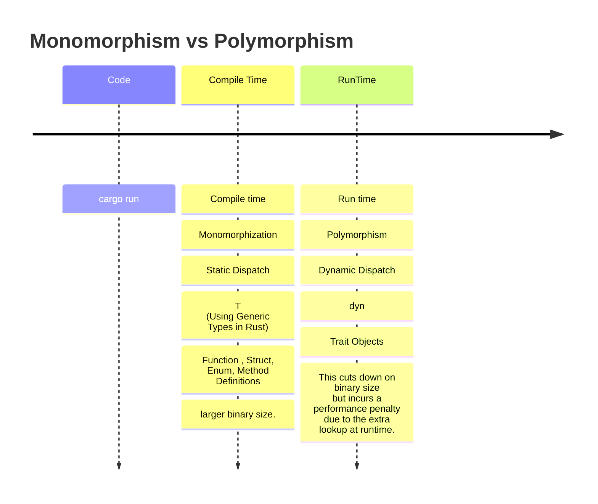

# Monomorphization vs Polymorphism

- Monomorphization

  This approach is extremely performant (in Rust this is known as a “zero-cost abstraction”) - however, due to monomorphization, this does create a larger binary size.

- Polymorphism

  This cuts down on binary size (as no monomorphization is used here) but incurs a performance penalty due to the extra lookup at runtime. This approach also explicitly forbids the use of generics.



# Monomorphism 설명

- https://oswalt.dev/2021/06/using-generic-types-in-rust/

- https://doc.rust-lang.org/book/ch10-01-syntax.html#performance-of-code-using-generics

- https://en.wikipedia.org/wiki/Monomorphization

# Polymorphism 설명

- https://oswalt.dev/2021/06/polymorphism-in-rust/

- https://en.wikipedia.org/wiki/Parametric_polymorphism

# Debugging LLVM

```
$ rustc main.rs --emit=llvm-ir -O -C no-prepopulate-passes

```

https://rustc-dev-guide.rust-lang.org/backend/debugging.html

# Profile-guided Optimization

```
rustup component add llvm-tools-preview


# STEP 1: Compile the binary with instrumentation

rustc -Cprofile-generate=/tmp/pgo-data -O ./main.rs

```

https://doc.rust-lang.org/rustc/profile-guided-optimization.html

# dump-mir

```
rustc -Z dump-mir=main main.rs

```

https://rustc-dev-guide.rust-lang.org/mir/debugging.html

# Reading a .pdb file

Microsoft released the source code of their PDB formats, so other compiler developers like the LLVM team can implement the PDB format easier.

https://github.com/Microsoft/microsoft-pdb/

To actually dump the output of a file, just use this:

https://github.com/Microsoft/microsoft-pdb/blob/master/cvdump/cvdump.exe

```
cvdump Whatever.pdb

```

https://stackoverflow.com/questions/2040132/reading-a-pdb-file

# Rustup book

https://rust-lang.github.io/rustup/overrides.html

# pacak/cargo-show-asm

cargo subcommand showing the assembly, LLVM-IR and MIR generated for Rust code

https://github.com/pacak/cargo-show-asm

- Install

```
$ cargo install cargo-show-asm
```

- cargo asm

```
$ cargo asm --lib
Try one of those
"<&T as core::fmt::Display>::fmt" [17, 12, 12, 12, 12, 19, 19, 12]
"<&mut W as core::fmt::Write>::write_char" [20]
"<&mut W as core::fmt::Write>::write_fmt" [38]
"<&mut W as core::fmt::Write>::write_str" [90]
"<F as nom::internal::Parser<I,O,E>>::parse" [263]
#
```
