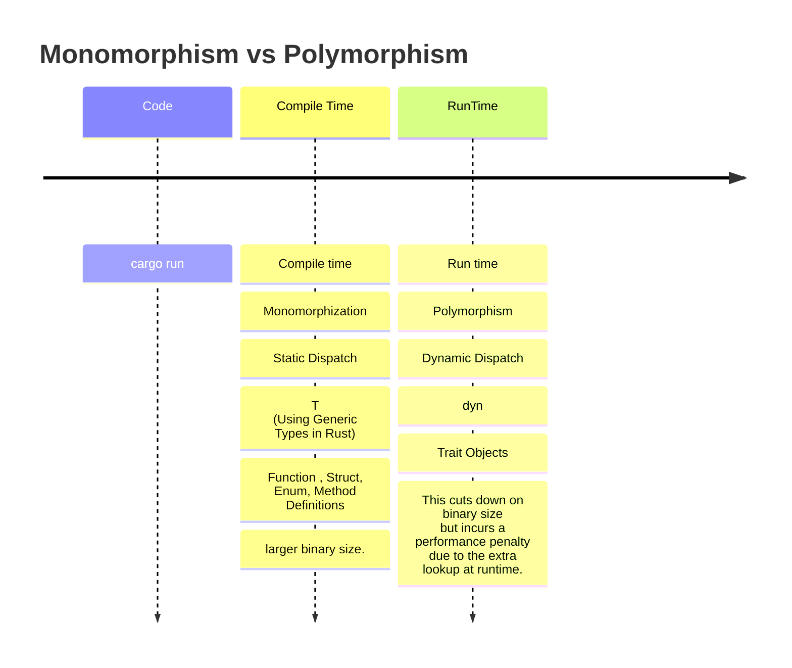

# Monomorphization vs Polymorphism

- Monomorphization

     This approach is extremely performant (in Rust this is known as a “zero-cost abstraction”) - however, due to monomorphization, this does create a larger binary size.

- Polymorphism

    This cuts down on binary size (as no monomorphization is used here) but incurs a performance penalty due to the extra lookup at runtime. This approach also explicitly forbids the use of generics.





# Monomorphism 설명

- https://oswalt.dev/2021/06/using-generic-types-in-rust/

- https://doc.rust-lang.org/book/ch10-01-syntax.html#performance-of-code-using-generics

- https://en.wikipedia.org/wiki/Monomorphization

# Polymorphism 설명

- https://oswalt.dev/2021/06/polymorphism-in-rust/

- https://en.wikipedia.org/wiki/Parametric_polymorphism

# Debugging LLVM

```
$ rustc main.rs --emit=llvm-ir -O -C no-prepopulate-passes

```

https://rustc-dev-guide.rust-lang.org/backend/debugging.html

# Profile-guided Optimization

```
rustup component add llvm-tools-preview


# STEP 1: Compile the binary with instrumentation

rustc -Cprofile-generate=/tmp/pgo-data -O ./main.rs

```

https://doc.rust-lang.org/rustc/profile-guided-optimization.html
