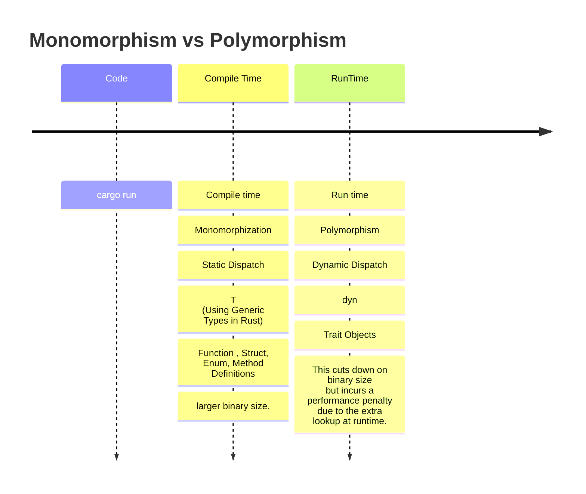

# Monomorphization vs Polymorphism

- Monomorphization

  This approach is extremely performant (in Rust this is known as a “zero-cost abstraction”) - however, due to monomorphization, this does create a larger binary size.

- Polymorphism

  This cuts down on binary size (as no monomorphization is used here) but incurs a performance penalty due to the extra lookup at runtime. This approach also explicitly forbids the use of generics.



# Monomorphism 설명

- https://oswalt.dev/2021/06/using-generic-types-in-rust/

- https://doc.rust-lang.org/book/ch10-01-syntax.html#performance-of-code-using-generics

- https://en.wikipedia.org/wiki/Monomorphization

# Polymorphism 설명

- https://oswalt.dev/2021/06/polymorphism-in-rust/

- https://en.wikipedia.org/wiki/Parametric_polymorphism

# Debugging LLVM

```
$ rustc main.rs --emit=llvm-ir -O -C no-prepopulate-passes

```

https://rustc-dev-guide.rust-lang.org/backend/debugging.html

# Profile-guided Optimization

```
rustup component add llvm-tools-preview


# STEP 1: Compile the binary with instrumentation

rustc -Cprofile-generate=/tmp/pgo-data -O ./main.rs

```

https://doc.rust-lang.org/rustc/profile-guided-optimization.html

# dump-mir

```
rustc -Z dump-mir=main main.rs

```

https://rustc-dev-guide.rust-lang.org/mir/debugging.html

# Reading a .pdb file

Microsoft released the source code of their PDB formats, so other compiler developers like the LLVM team can implement the PDB format easier.

https://github.com/Microsoft/microsoft-pdb/

To actually dump the output of a file, just use this:

https://github.com/Microsoft/microsoft-pdb/blob/master/cvdump/cvdump.exe

```
cvdump Whatever.pdb

```

https://stackoverflow.com/questions/2040132/reading-a-pdb-file

# Rustup book

https://rust-lang.github.io/rustup/overrides.html

# pacak/cargo-show-asm

cargo subcommand showing the assembly, LLVM-IR and MIR generated for Rust code

https://github.com/pacak/cargo-show-asm

- Install

```
$ cargo install cargo-show-asm
```

- cargo asm

```
$ cargo asm --lib
Try one of those
"<&T as core::fmt::Display>::fmt" [17, 12, 12, 12, 12, 19, 19, 12]
"<&mut W as core::fmt::Write>::write_char" [20]
"<&mut W as core::fmt::Write>::write_fmt" [38]
"<&mut W as core::fmt::Write>::write_str" [90]
"<F as nom::internal::Parser<I,O,E>>::parse" [263]
#
```

# WindowsOS(Objdump)

https://github.com/CyberGrandChallenge/binutils/blob/master/binutils/objdump.c

https://github.com/CyberGrandChallenge/binutils

# LLVM tools(Rust)

- cargo-binutils

  - cargo-binutils[](https://crates.io/crates/binutils)<a href="https://github.com/rust-embedded/cargo-binutils/"></a>
    

  - <p dir="auto"><a href="https://github.com/rust-embedded/cargo-binutils/" rel="nofollow">Guides</a> | <a href="https://github.com/rust-embedded/cargo-binutils#cargo-binutils" rel="nofollow">API Docs</a></p>

  https://github.com/rust-embedded/cargo-binutils/

  https://crates.io/crates/cargo-binutils

  Cargo subcommands to invoke the LLVM tools shipped with the Rust toolchain

  - Installation

```
$ cargo install cargo-binutils

$ rustup component add llvm-tools-preview
```

https://releases.llvm.org/11.0.0/docs/CommandGuide/llvm-objdump.html

# cargo-binutils(간단한 사용법)

https://github.com/YoungHaKim7/YouTubeContents_GlobalYoung/tree/main/230317_Rust_Monomorphization_vs_Polymorphism/Polymorphism/trait_impl

https://crates.io/crates/cargo-binutils

- 잘정리됨
  https://github.com/rust-embedded/cargo-binutils/

```
$ cargo objdump --release -- --disassemble --no-show-raw-insn | grep -A 10 -B 10 "main"

Finished release [optimized] target(s) in 0.00s
100002aa8: str xzr, [sp]
100002aac: adr x8, #196404
100002ab0: nop
100002ab4: stp x8, xzr, [sp, #32]
100002ab8: mov x0, sp
100002abc: bl 0x100017d64 <\_std::io::stdio::\_print::hf5189a9887145206>
100002ac0: ldp x29, x30, [sp, #48]
100002ac4: add sp, sp, #64
100002ac8: ret

0000000100002acc <_trait_impl::main::hc7d33c912fbb6232>:
100002acc: stp x29, x30, [sp, #-16]!
100002ad0: mov x29, sp
100002ad4: bl 0x100002a0c <_<trait*impl::Lion as trait_impl::Growler>::growl::h8fae6da4cb71fbad>
100002ad8: bl 0x100002a4c <*<trait*impl::Tiger as trait_impl::Growler>::growl::h818e891a091e4820>
100002adc: ldp x29, x30, [sp], #16
100002ae0: b 0x100002a8c <*<trait_impl::Bear as trait_impl::Growler>::growl::hd762be638330fd3d>

0000000100002ae4 <\_main>:
100002ae4: sub sp, sp, #32
100002ae8: stp x29, x30, [sp, #16]
100002aec: add x29, sp, #16
100002af0: mov x3, x1
100002af4: sxtw x2, w0
100002af8: adr x8, #-44
100002afc: nop
100002b00: str x8, [sp, #8]
100002b04: adr x1, #251716
100002b08: nop

```

# rust_웹으로 어셈블리 보기Assembly

https://rust.godbolt.org/

- 뒤에 최적화 옵션

```
-C opt-level=3 --target i686-unknown-linux-gnu
```

>>- <a href="https://github.com/YoungHaKim7/my_rust_project/tree/main/06_Rust_Optimization#rustc">target list </a>
>>```
>>$ rustc --print target-list
>>```
