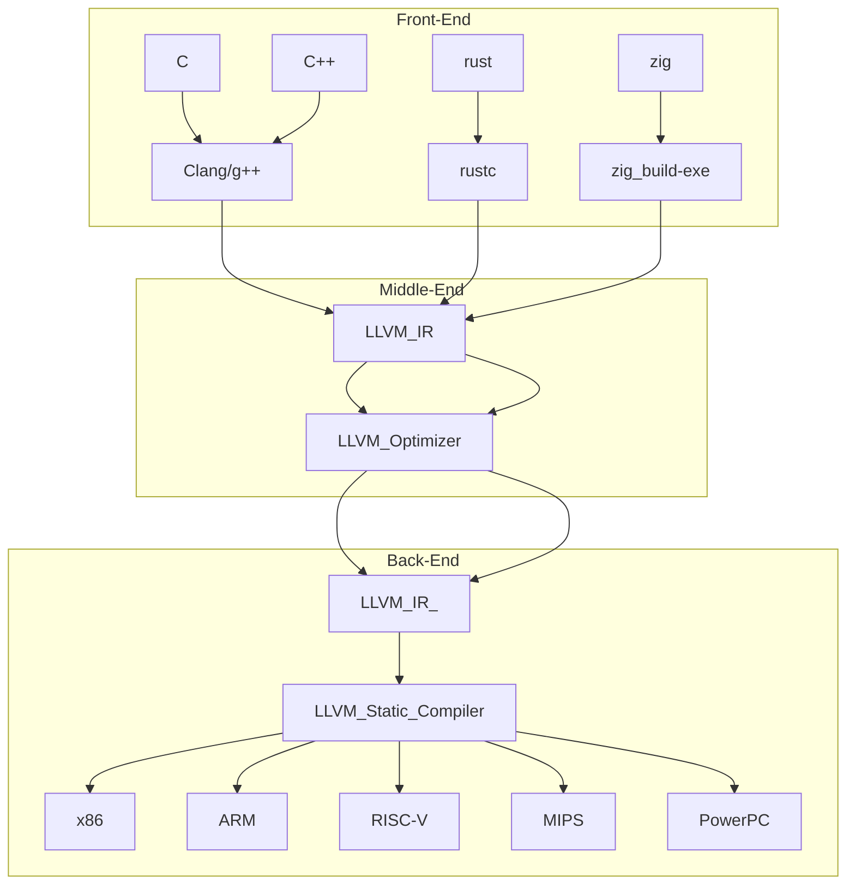

# Rust game 만들기 ggez

https://github.com/ggez/ggez

# Source

https://gist.github.com/AndrewJakubowicz/3cc636d10bd1dfe1abd08b990472b822

# Using Rust and Specs to make a Roguelike

https://youtu.be/1oSnLVE3YbA


# Rust Videos(2D game만들기 시리즈)

https://youtube.com/playlist?list=PLVT0QN6kDrbd3KZr4EkBNvjSDTaZyxwhM


# helix 23.03  Windows OS 설치 완료 Mission Complete

# scoop

https://github.com/ScoopInstaller/Scoop

```
llvm -> clang C언어 C++
g++
clangd -> C언어의 LSP 지원 -> 타입이 나온다.type

c / c++ / zig  / rust 

```

<li><strong><em>Front-end:</em></strong> compiles source language to IR.</li>

<li><strong><em>Middle-end:</em></strong> optimizes IR.
    
<li><strong><em>Back-end:</em></strong> compiles IR to machine code.


    


https://blog.gopheracademy.com/advent-2018/llvm-ir-and-go/

# Helix (ver23.03) tutorial (heilx was made of rust)

- https://github.com/helix-editor/helix

- https://helix-editor.com/

- Helix Tutorial

<table border="1">
    <tr>
    <td colspan="3" align="center">Rust (Helix Text editor)<br><a href="https://github.com/helix-editor/helix">Helix Text editor</td>
    </tr>
    <tr align="center">
        <td>Date</td>
        <td>OS</td>
        <td>Title & Link</td>
    </tr>
    <tr align="center">
        <td>23-4-16(sat.)</td>
        <td>WindowsOS</td>
        <td><a href="https://youtu.be/_KAnc1QehMk">한글Rust_072⭐️Rust ggez_game_helix tutorial ver23.03 WindowsOS #helix #inlayhint #rustlang #scoop</td>
    <tr align="center">
        <td>23-4-09(sun.)</td>
        <td>Linux<br>& macOS</td>
        <td><a href="https://youtu.be/uwu0vv3em3c">한글Rust_071⭐️Rust Backend_WebSever_helix tutorial ver23.03 #helix #rustlang</td>
    </tr>
    <tr align="center">
        <td>22-9-17(sat.)</td>
        <td>macOS</td>
        <td><a href="https://youtu.be/cZfF1XRoIC8">한글러스트Rust강의_041⭐️Rust로 만든 에디터Helix기초_helix tutorial #rustlang #helix</td>
    </tr>
</table>
